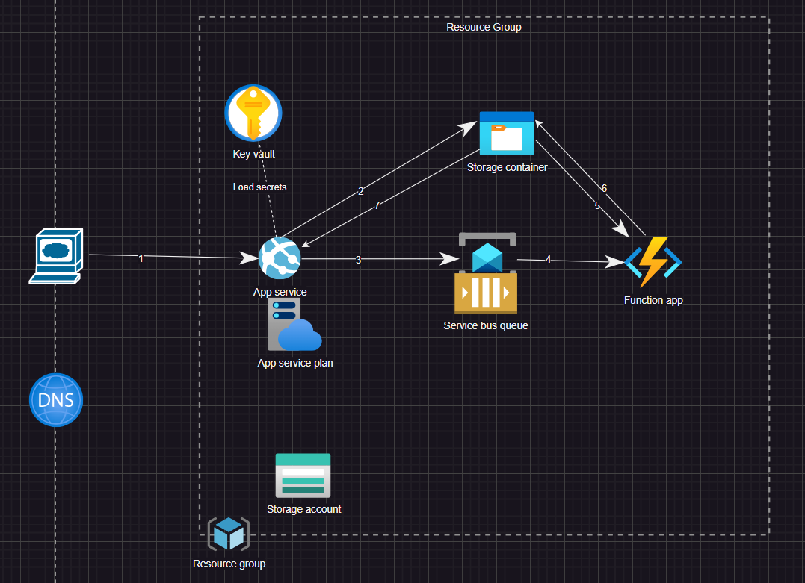

<h1> Introduction </h1>
Welcome to image processing application. The application has a simple use case, tranforming color image into monochrome one.

The flow is as follows:

An user posts an image through API. The WebApp saves the image in the Blob storage and sends a message to Service bus. The Service Bus triggers the FunctionApp once the message is received to process the image. The FunctionApp donwloads the image, process(change to monochrome) it and uploads it back to BlobStorage. Once it is done, the processed image is accessible via url returned from GET API.

The project includes several pipelines for deploying infrastrcuture to azure, code deployment, and tfstate archivation to blob storage. 

<h2> Image processing project </h2>
The project is located in folder image_processing_app and provides a simple API for sending/receving images. The API is then available through OpenApi generated page on path url-to-app/swagger. The description can be found in OpenApi specification added to the corresponding folder(TO BE IMPLEMENTED).

<h2> Infrastructure </h2>
The project is located in folder azure_image_processing_infrastructure and contains simple CDKTF C# stack to provision infrastructure services to Azure cloud.

The following diagram depicts the architecture.

<h2> Function app </h2>
not relevant, to be implemented